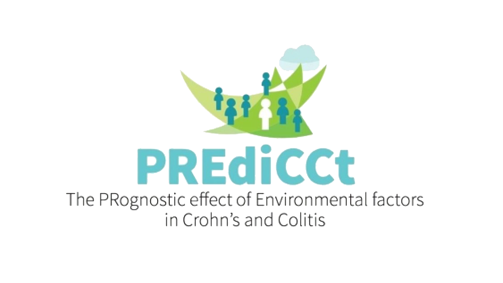

# Analyses for PREdiCCt 

This repository contains the analyses for the PREdiCCt study. The generated
reports are hosted [here](https://www.constantine-cooke.com/predicct-analysis/).

## Introduction

The PREdiCCt study (NCT03282903) is a UK-wide prospective study of inflammatory
bowel disease (IBD) patients. PREdiCCt recruited 2629 patients with IBD in
remission across 47 sites in the UK. 

The study aimed to determine which aspects of a) baseline habitual diet, b) the
environment, c) genetic variation, and d) the gut microbiota, predict disease
flare in Crohn’s disease and/or ulcerative colitis and IBD unclassified (IBDU).

Participants were recruited in remission and were extensively phenotyped via
questionnaires completed by patients and care teams. Participants were then
followed until disease flare.

At present, this repository describes two projects. The first project, led by
**Dr Nathan Constantine-Cooke**, is concerned with clinical and dietary data. The 
second project concerns the mental health data collected by the study and is
led by **Dr Chiara Cotronei**. Additional projects from PREdiCCt are expected in 
the future which will use data from genome and microbiome sequencing of the 
study participants. 

## Usage

[](https://cran.r-project.org/)
[](https://github.com/nathansam/predicct-analysis/pkgs/container/predicct)
[](https://quarto.org/docs/get-started/)

Re-rendering these reports requires access to PREdiCCt datasets hosted by the University of
Edinburgh. For access to these data,
please [contact Professor Charlie Lees](mailto:charlie.lees@ed.ac.uk).

Once you have access to the data, you should mount
`smb://cmvm.datastore.ed.ac.uk/igmm/` to `/Volumes/`. From a terminal, `cd` into the directory you have cloned this repository into.

To re-run the analyses, you can either use Docker (preferred) or use your native
operating system.

### Docker

Docker containers are standardized, executable components that combine
application source code with the operating system libraries and dependencies
needed to run that code in any environment. This makes it easy to ensure that
the code runs the same way on all machines.

If Docker is not already installed, then first [install Docker](https://docs.docker.com/get-docker/).

The Docker image can then be pulled from the GitHub Container Registry.

``` bash
docker pull ghcr.io/nathansam/predicct
```

The following command can then be used to re-run the analyses via a Docker
container. 

``` bash
docker container run  \
  --mount type=bind,source="/Volumes/igmm/cvallejo-predicct/predicct/",target="/analysis/data" \
  --mount type=bind,source="$(pwd)/docs",target="/analysis/docs" \
  --mount type=bind,source="$(pwd)/src",target="/analysis/src" \
  --rm \
  ghcr.io/nathansam/predicct
```

Due to the large size of the image (3.77GB), you may wish to delete the image after running the analysis.

``` bash
docker image rm ghcr.io/nathansam/predicct
```

### Natively

If running the analyses natively, you will need [R](https://cran.r-project.org/)
and [Quarto](https://quarto.org/docs/get-started/).

The following R packages are required to be installed:

```
[1] "gtsummary"     "readxl"        "survival"      "survminer"     "tidyverse"     "ggplot2"       "plotly"       
[8] "shiny"         "coxme"         "datefixR"      "pander"        "plyr"          "tools"         "splines"      
[15] "patchwork"     "DiagrammeR"    "DiagrammeRsvg" "knitr"         "lubridate"     "table1"        "rmarkdown"    
[22] "reshape2"      "colorspace"    "htmltools"     "finalfit"      "ggdist"        "kableExtra"    "openxlsx"     
[29] "rstatix"       "tidyr"         "scales"        "DescTools"
```

You can run `quarto render` from the `src` directory to re-run all analyses.
Afterwards, you will be able to find the rendered reports in the docs directory. 

``` bash
cd docs
python3 -m http.server
```

## Acknowledgements

This work uses data provided by participants and the NHS. We are grateful to
the study participants and their IBD care teams for their support.

## Licensing


The code is licensed under [GPL-3](LICENSE) whilst this text in the reports is licensed under a
[Creative Commons Attribution 4.0 International License][cc-by]. 

[](https://www.gnu.org/licenses/gpl-3.0)
[![CC BY 4.0][cc-by-image]][cc-by] 

[cc-by]: http://creativecommons.org/licenses/by/4.0/
[cc-by-image]: https://i.creativecommons.org/l/by/4.0/88x31.png
